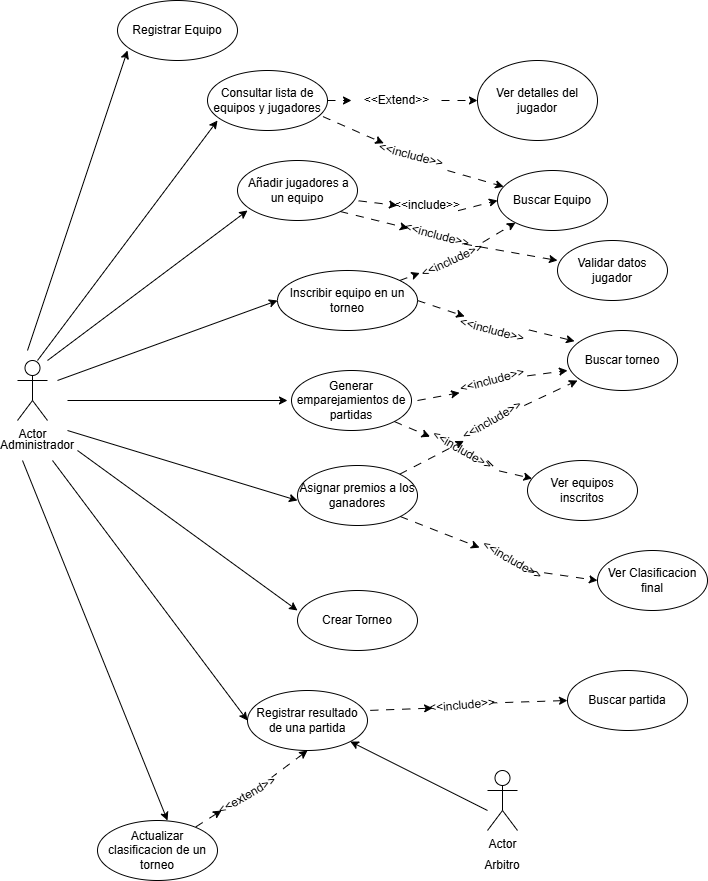
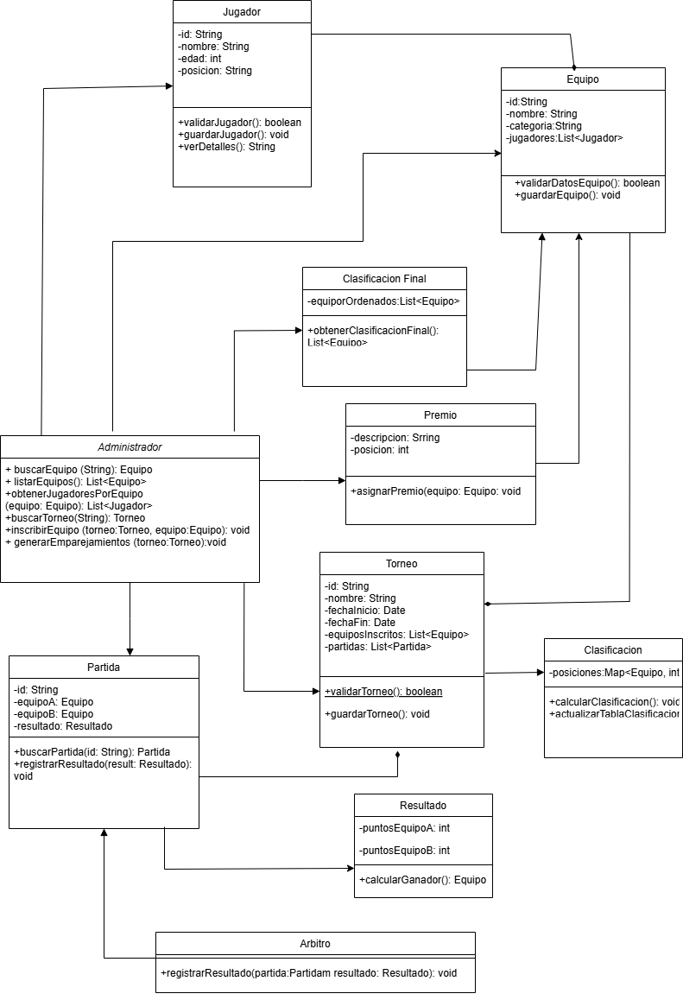

# Actividad3EsportsUML
creacion de proyecto torneo Esports UML

# Sistema de Gestion de Torneos de eSports

## Autor
Soraya Turegano González
GitHub: SorayaTG13

# Descripción del proyecto
Este sistema permite gestionar torneos deportivos, incluyendo el registro de equipos y jugadores, creación de torneos, emparejamiento de partidas, registro de resultados, clasificación y asignación de premios. Está diseñado para ser utilizado principalmente por administradores y árbitros.

## 1. Analisis del problema y requisitos del sistema

### Objetivos del sistema
Gestionar de forma integral torneos deportivos desde el registro de los jugadores por parte de los administradores hasta el momento de la clasificacion y los premios.

### Actores del sistema
- **Administrador**: Principal gestor del sistema.
- **Arbitro**: Encargado de registrar los resultados de las partidas.

### Funciones de cada actor

#### Administrador: 
- Registrar equipos y jugadores.
- Consultar listas de equipos/jugadores.
- Crear torneos.
- Inscribir equipos.
- Generar emparejamientos.
- Actualizar clasificacion.
- Asignar premios.

#### Arbitro:
- Registrar resultados de las partidas.

### Relaciones entre entidades:
- Un torneo tiene varios jugadores.
- Un torneo tiene varios equipos inscritos.
- Cada troneo genera partidas que enfrentan equipos.
- Cada partida tiene un resultado.
- Los resultados actualizan la clasificacion del torneo.
- Se asignan premios segun la clasificacion final.

## 2. Casos de Uso:

### Gestión de Equipos y Jugadores:
- Registrar equipo.
- Añadir jugadores a un equipo .
- Consultar lista de equipos y jugadores.

### Gestión de Torneos:
- Crear torneo.
- Inscribir equipo en un torneo.
- Generar emparejamiento.

### Gesión de Partidas y Resultados:
- Registrar resultado de partida.
- Actualizar clasificacion.

### Gestión de Premios:
- Asignar Premios.

He realizado un diagrama de clases de uso completo para que así se entienda mucho mejor el conjunto de todo el sistema gestor de partidas.
Partimos de un "actor" administrador que en mi caso será el mayor responsable y encargado de todas las funciones de la aplicación, el cual se encargará de Registrar al equipo, consultar la lista de equipos y jugadores ya creada, inscribir a los distintos equipos en el torneo, realizar el emparejamiento para las partidas de los torneos, crear los propios torneos, registrar el resultado de una partida, que este a su vez, pero no necesariamente puede actualizar automaticamente la clasificacion. Además habrá otro actor presente que va a ser el "actor" arbitro, que será el encargado de supervisar también el registro de las partidas y las relaciones que existen con cada acción son ver los detalles de cada jugador, la búsqueda de equipo, el validar todos los datos de los jugadores, la busqueda de torneos, ver los equipos inscritos, ver la clasificacion final y la busqueda de partidas.
Todos y cada uno de estos casos han sido creados para llevar el correcto proceso de lo que sería la creacion de un equipo, inscripción de un equipo a un torneo, añadir los jugadores al equipo, la creacion de partidas, el registro de resultados de las mismas y la entrega final de premios al ganador.

## 3. Identificacion de clases y relaciones:

### Clases:
- Administrador
- Arbitro
- Jugador
- Equipo
- Partida
- Torneo
- Resultado
- Clasificacion
- Clasificacion Final
- Premio

### Clases entidad:
- Equipo
- Jugador
- Torneo
- Partida
- Premio
- Resultado
- Clasificacion
- Premio

### Clases control:
- Equipo
- Torneo
- Partida
- Clasificacion
- Premio

### Clases interfaz:
- Administrador
- Arbitro

## 4. Creacion del diagrama de clases UML

Este diagrama nos permite definir la estructura logica del sistema, representando las clases, atributos, métodos y como se relacionan entre estos.
La Estructura del sistema estan divididos en 3 clases, las clases de entidad, control e interfaz. La clases de entidad están formadas por la clase Equipo, Jugador, Torneo,... Las clases de control manejan la lógica y los flujos entre entidades, como pueden ser la clases partida, clasificación, premio... Por último las clases de intarfaz representan la interacción que va a existir entre sistena y actores en este caso serán la clase Administrador y Arbitro.

Las relaciones que existen entre las clases pueden ser tanto de composición como de agregación. Un ejemplo de composición en este caso es la relación existente entre Equipo y Jugador, ya que un jugador no existe fuera del equipo. Y una relación de agregación puede ser entre torneo  equipo, por que los equipos pueden existir sin un torneo.

La ventaja de este diseño es que ofrece modularidad, ya que cada parte del sistema está bien separada. El mantenimiento es fácil. Si se necesita separar la logica de alguno de los métodos se puede realizar sin afectar al resto del sistema. Tiene escalabilidad, por que se pueden ir añadiendo equipos, torneos, etcsin afectar al resto.

Respecto a las relaciones tenemos tres tipos de relacion aplicada, la relacion de composición, de agregación y de dependencias.
Se ha utilizado las composiciones donde hay dependencias fuertes entre clases, agregaciones para mantener independencias y dependencias simples para controlar las interface